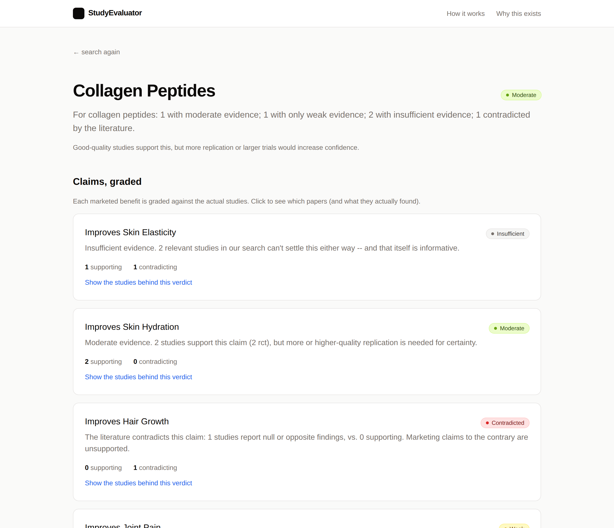

# StudyEvaluator

**What the studies actually say.** A full-stack web app that pulls the
literature for a health/wellness product, scores each study's quality,
aligns marketed claims to the actual findings, and surfaces a transparent,
evidence-graded verdict.

The problem this exists to solve: misinformation about supplements,
skincare, and "biohacks" is usually backed by a screenshot of a real
study that either (a) doesn't say what the post claims, (b) is on mice
at unrealistic doses, (c) is industry-funded with n=22, or (d) is one
positive RCT while a meta-analysis says null. StudyEvaluator catches all
four failure modes.



## What it does

For a product like "collagen peptides":

1. **Ingests** up to 25 candidate studies from PubMed (E-utilities, no key needed).
2. **Extracts** structured features from each: design (RCT / cohort / animal /
   in vitro / meta-analysis...), sample size, duration, blinding,
   randomization, pre-registration, funding source, conflict of interest,
   and directional findings.
3. **Scores quality** per-study (0–1) with an interpretable Cochrane-RoB-2
   rubric. Every score comes with a reasons list — no black-box numbers.
4. **Derives marketed claims** ("improves skin elasticity", "improves hair
   growth") from the literature, or accepts user-supplied claims.
5. **Aligns** each (claim, study) pair with one of {supports, partially
   supports, unrelated, contradicts} using TF-IDF + finding-direction
   routing.
6. **Aggregates** per-claim with a GRADE-inspired rubric and surfaces
   **red flags** (industry funding concentration, small-N dominance,
   non-human dominance, retractions, no RCTs, low overall quality) as
   separate signals — not hidden inside a single number.

The example output for collagen peptides:

| Claim                  | Verdict       | Why                                                  |
| ---------------------- | ------------- | ---------------------------------------------------- |
| improves skin hydration | **moderate**  | Two RCTs support, both pre-registered                |
| improves skin elasticity | **insufficient** | One RCT for, one (larger) RCT against           |
| improves joint pain    | **weak**      | Only a small industry-funded pilot                   |
| improves hair growth   | **contradicted** | A meta-analysis explicitly reports null         |
| improves wound healing | **insufficient** | Animal-only evidence — doesn't license human claim |

## Architecture

```
┌────────────────────┐    ┌──────────────────────────────────────────────────┐
│  Next.js frontend  │ ─► │  FastAPI                                        │
│  (App Router, TS)  │ ◄─ │   /api/search   /api/jobs/:id   /api/products/:slug │
└────────────────────┘    └──────────────────────────────────────────────────┘
                                          │
                                          ▼
                       ┌─────────────────────────────────────────┐
                       │  Analysis pipeline                      │
                       │  ingest → extract → quality → claims    │
                       │       → alignment → aggregate           │
                       └─────────────────────────────────────────┘
                                          │
                                          ▼
                       ┌────────────────────────┐
                       │  SQLite (verdict cache) │
                       └────────────────────────┘
```

The pipeline is six pure modules in `api/pipeline/`. Each has a single
responsibility, a typed I/O contract (`api/schemas.py`), and a unit-test
file. Anything ML-shaped (`quality.py`, `alignment.py`) has both a
ships-today implementation and an interface designed so a trained model
drops in without touching the rest of the system.

### Key files

| Path                              | What                                                                  |
| --------------------------------- | --------------------------------------------------------------------- |
| `api/schemas.py`                  | Pydantic types shared by every stage and the API.                     |
| `api/pipeline/ingest.py`          | PubMed E-utilities client + XML parser.                               |
| `api/pipeline/extract.py`         | Title/abstract -> structured features (design, n, blinding, COI, …). |
| `api/pipeline/quality.py`         | `RubricQualityScorer` (interpretable) + `MLQualityScorer` (drop-in). |
| `api/pipeline/claims.py`          | Auto-derive candidate marketed claims from the corpus.                |
| `api/pipeline/alignment.py`       | (Claim, study) -> supports/contradicts/unrelated.                     |
| `api/pipeline/aggregate.py`       | GRADE-inspired claim verdicts + red-flag detection.                   |
| `api/pipeline/run.py`             | Orchestrator: `analyze_product(query) -> ProductVerdict`.             |
| `api/jobs.py`                     | In-process async job runner with progress callbacks.                  |
| `api/routes/search.py`            | HTTP endpoints.                                                       |
| `web/app/product/[slug]/page.tsx` | Verdict page with claim/study drilldowns.                             |

## Running locally

Two services. SQLite, no broker, no API keys required.

```bash
# 1. Backend
python3 -m venv .venv
.venv/bin/pip install -r requirements.txt

# Optional: seed with the demo collagen verdict so you have something to
# look at without hitting PubMed.
PYTHONPATH=. .venv/bin/python scripts/seed_demo.py

# Run the API
PYTHONPATH=. .venv/bin/uvicorn api.main:app --reload --port 8001
```

```bash
# 2. Frontend (in another terminal)
cd web
npm install
npm run dev   # http://localhost:3000
```

Search for "collagen peptides" and you'll get the seeded verdict instantly.
Search anything else and the pipeline kicks off a live PubMed query.

## Tests

```bash
PYTHONPATH=. .venv/bin/python -m pytest -q
```

26 tests cover:
- PubMed XML parsing (`test_ingest.py`)
- Feature extraction for every design class, blinding/randomization/funding
  detection, sample size and duration parsing (`test_extract.py`)
- Rubric scoring: meta-analyses outscore case series, industry funding
  lowers risk-of-bias, animal studies have low external validity, every
  score is bounded and reasoned (`test_quality.py`)
- End-to-end pipeline on a fixture corpus: contradicted claims come back
  contradicted, animal-only evidence doesn't license human claims, red
  flags fire when they should (`test_pipeline.py`)

## What ships today vs. what's designed to slot in

The model story is intentionally layered:

- **Quality scorer.** Ships as a rubric — every score is interpretable and
  the demo runs without any training data. The feature vector
  (`api/pipeline/quality.py:featurize`) is the contract: train a
  gradient-boosted classifier on the same features over Cochrane RoB 2
  labels + Retraction Watch and the `MLQualityScorer` picks it up
  automatically.

- **Alignment classifier.** Ships as TF-IDF + finding-direction routing.
  The upgrade path is a fine-tuned NLI model on SciFact / HealthVer
  behind the same `AlignmentScorer.classify` signature.

- **Ingestion.** PubMed today. The ingest layer is a thin adapter that
  returns `RawRecord` — add Cochrane / Semantic Scholar / Europe PMC
  adapters and merge by DOI.

## Product principles

These are the things that make the difference between "another LLM
wrapper" and a tool that actually helps people:

- **Show the work.** Every grade is one click away from the specific
  studies and the specific quality features that produced it.
- **Plain language.** Effect sizes in human terms, not p-values.
- **Name the absence of evidence.** "Insufficient" is a valid, useful
  answer. We don't fake a verdict.
- **Distinguish ingredient from product.** Studies test isolated compounds
  at specific doses; the bottle on the shelf often isn't equivalent.
- **Determinism.** Same query, same verdict. Every grade traces to the
  same auditable scoring rules and model version.

## License

MIT.
